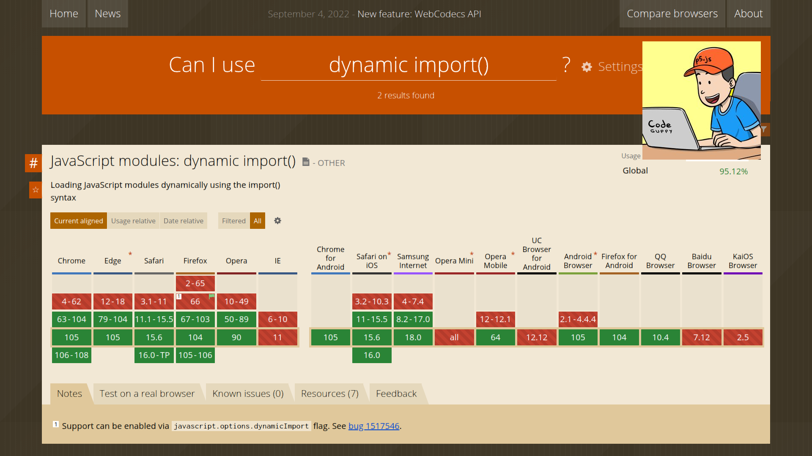
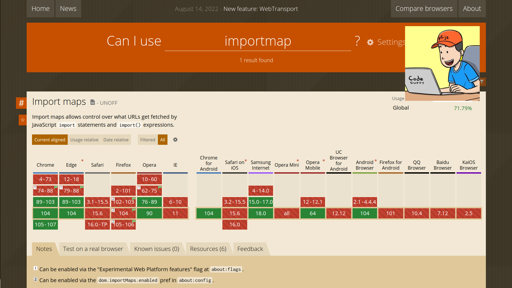
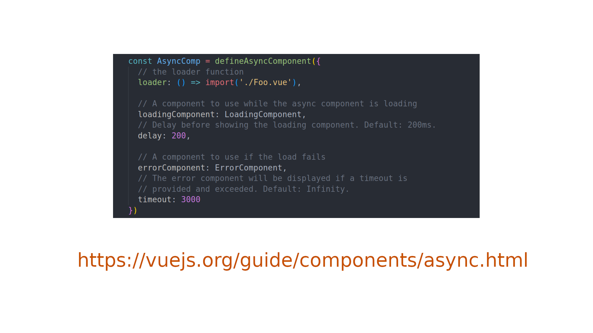

<!--
  $theme: default
  pretender: true
  footer: Matthias Hryniszak - SoftServe 2022-08-31
-->

<!--
  *footer:
-->

# Microfrontends done right!

#### by Matthias Hryniszak

---

# Rules of egagement

- if you feel you have a question - interrupt me and ask
- be mindfull of your colleques
- try to enjoy using it as much as I did writing it :)

---

# This presentation is on Github

https://github.com/padcom/microfrontends-done-right

---

# Let's get down to business!

---

# 2 reasons to use microfrontends

- separation of code
- separation of publishing

---

---

# 3 types of microfrontends

- full pages (use `iframe`)
- applications
- components

---

# 3 types of microfrontends

- full pages (use `iframe`)
- __applications__
- __components__

---

---

---

---

---

# Strategies for dependency management

- package everything
- don't package common libraries
- don't use a bundler

---

# NPM coordinates scheme

## @scope/package-name@version/path/within/package

---

# Supported semantic versioning scheme

## major.minor.patch+tag.iteration-meta.build

---

# Questions?

---

# May the force be with you! Always!

Blog:
https://padcom13.blogspot.com

LinkedIn:
https://linkedin.com/in/padcom

---

